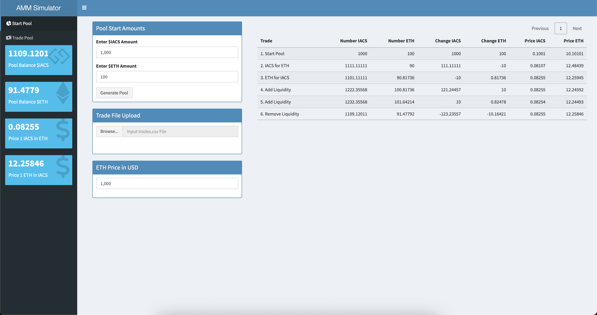
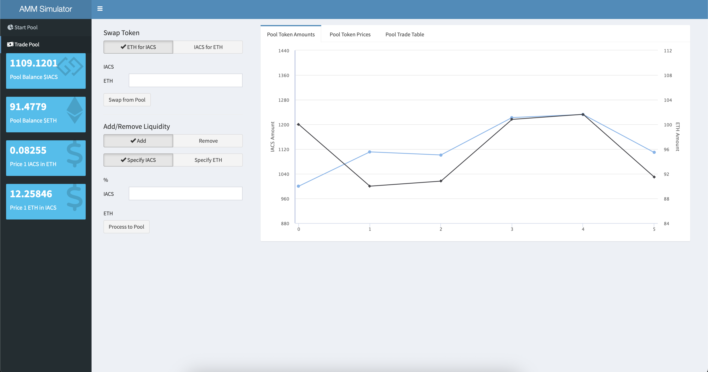

# AMM Simulator 🦄📈

A tiny Shiny dashboard that lets you play market-maker with a Uniswap-style constant-product pool.





---

## What It Does

* **Start a pool** with any mix of `IACS` (fake ERC-20) and `ETH`.
* **Trade either way** (ETH → IACS or IACS → ETH) one-off or by uploading a `trades.csv`.
* **Add / remove liquidity** in tokens or by percentage.
* **See it live**: token balances, price ratios, USD price, and a running trade ledger.
* Built-in sanity checks stop negative balances and malformed CSV rows.

---

## Quick Start

```r
git clone https://github.com/OmniacsDAO/amm-simulator.git
cd amm-simulator

install.packages(c(
  "shiny", "shinydashboard", "shinyWidgets",
  "DT", "dygraphs", "highcharter"
))

shiny::runApp()
```

---

## Bulk-Trade CSV

| column    | sign | meaning                               | example                          |
| --------- | ---- | ------------------------------------- | -------------------------------- |
| `iacs_chg` | ±    | Δ IACS added to / removed from pool    | `-50` (swap 50 IACS for ETH)      |
| `eth_chg` | ±    | Δ ETH added to / removed from pool    | `+1.2` (add 1.2 ETH liquidity)   |
| `pct_chg` | −    | % of liquidity **removed** (negative) | `-10` (pull 10 % of both tokens) |

Exactly one column per row must be non-NA.

---

Made for tinkering, teaching, and the occasional “what happens if…?” moment. Have fun and mind the slippage!

---

*Maintained with ❤️ by **Omniacs.DAO** – accelerating digital public goods through data.*

---
🛠️ Keep public infrastructure thriving. Buy [$IACS](http://dexscreener.com/base/0xd4d742cc8f54083f914a37e6b0c7b68c6005a024) on Base — CA: 0x46e69Fa9059C3D5F8933CA5E993158568DC80EBf
